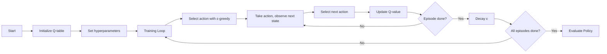

# ❄️ Frozen Lake SARSA Agent - Reinforcement Learning Project ❄️

This project implements the SARSA (State-Action-Reward-State-Action) reinforcement learning algorithm to solve the FrozenLake environment from Gymnasium. The agent learns to navigate a slippery grid world to reach a goal while avoiding holes. 🧊➡️🎯

## 🌐 Environment Overview
The FrozenLake environment features:
- 4×4 grid world (16 states) 🗺️
- 4 possible actions (←, ↓, →, ↑) 🎮
- Start state (S) and goal state (G) 🏁
- Frozen tiles (safe) and holes (H) that end the episode 🕳️
- Two modes:
  - **Slippery**: Stochastic transitions (33% chance of moving sideways) 🧊
  - **Non-slippery**: Deterministic transitions 🧊✅

## ⚙️ Implementation Details
- **Algorithm**: SARSA (on-policy TD control) 🧠
- **Action Selection**: ε-greedy policy with decay 🔁
- **Hyperparameters**:
  - Learning rate (α) = 0.1 📈
  - Discount factor (γ) = 0.95 💰
  - Initial ε = 0.9 🎲
  - ε decay = 0.995 ⏬
  - Minimum ε = 0.01 🎯
  - Episodes = 2000 (optimal for slippery) / 5000 🔁

## 📊 Performance Observations

### 🧊 Slippery Conditions (Stochastic Environment)
| Configuration       | Episodes | ε Decay | Avg. Success Rate | Performance |
|---------------------|----------|---------|-------------------|-------------|
| **Optimal** ✅       | 2000     | Yes     | 58%               | Best        |
| Suboptimal ❌       | 5000     | Yes     | Reduced           | Worse       |
| Without ε Decay     | 2000     | No      | Moderate          | Medium      |

**Key Findings**:
- 🏆 Best performance with 2000 episodes and ε decay
- ⚠️ 5000 episodes with ε decay performed worse (over-training?)
- 🔁 ε decay is crucial for balancing exploration/exploitation
- 🧪 Stochastic transitions make learning challenging

### 🧊 Non-slippery Conditions (Deterministic Environment)
| Configuration       | Episodes | ε Decay | Performance       |
|---------------------|----------|---------|-------------------|
| All tested          | 2000     | Yes     | Consistently High ✅ |
| All tested          | 5000     | No      | Consistently High ✅ |

**Key Findings**:
- ✅ Agent achieves near-perfect performance regardless of configuration
- 🧠 Environment simplicity makes learning straightforward
- ⚖️ ε decay has minimal impact due to deterministic transitions

## 💡 Key Insights
1. **Environment Matters**:
   - 🧊 Slippery conditions require careful hyperparameter tuning
   - 🧊 Non-slippery conditions are solved easily with any configuration

2. **ε Decay Strategy**:
   - 📉 Crucial for stochastic environments
   - ⚖️ Balances exploration vs exploitation
   - ⏱️ Requires proper tuning of decay rate and minimum ε

3. **Training Duration**:
   - ⏳ More episodes ≠ better performance
   - 🛑 Over-training can lead to policy degradation
   - 🔍 Optimal episode count differs between environments

4. **Algorithm Behavior**:
   - 🔄 SARSA performs well for on-policy learning
   - 🎯 Q-learning might yield better results in deterministic cases
   - 🧮 Expected SARSA could improve slippery condition performance

## 🔮 Future Improvements
- 🎯 Implement reward shaping for more efficient learning
- 🧠 Add neural network function approximation (Deep SARSA)
- 📊 Develop policy visualization tools
- ⚖️ Compare performance with Q-learning and Expected SARSA
- 🔁 Experiment with different exploration strategies
- 📈 Add training progress tracking and early stopping
- 🧪 Test on larger 8×8 FrozenLake maps

